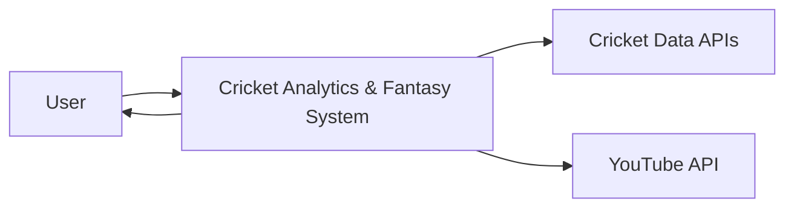
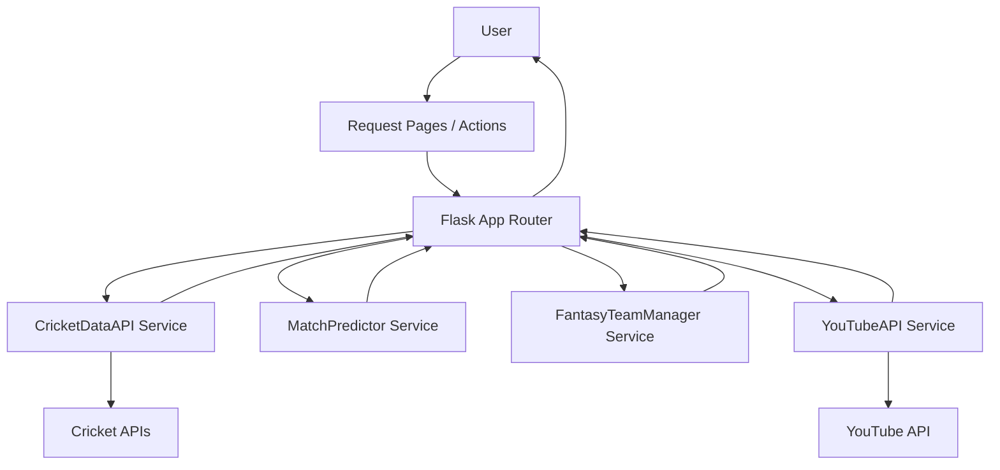
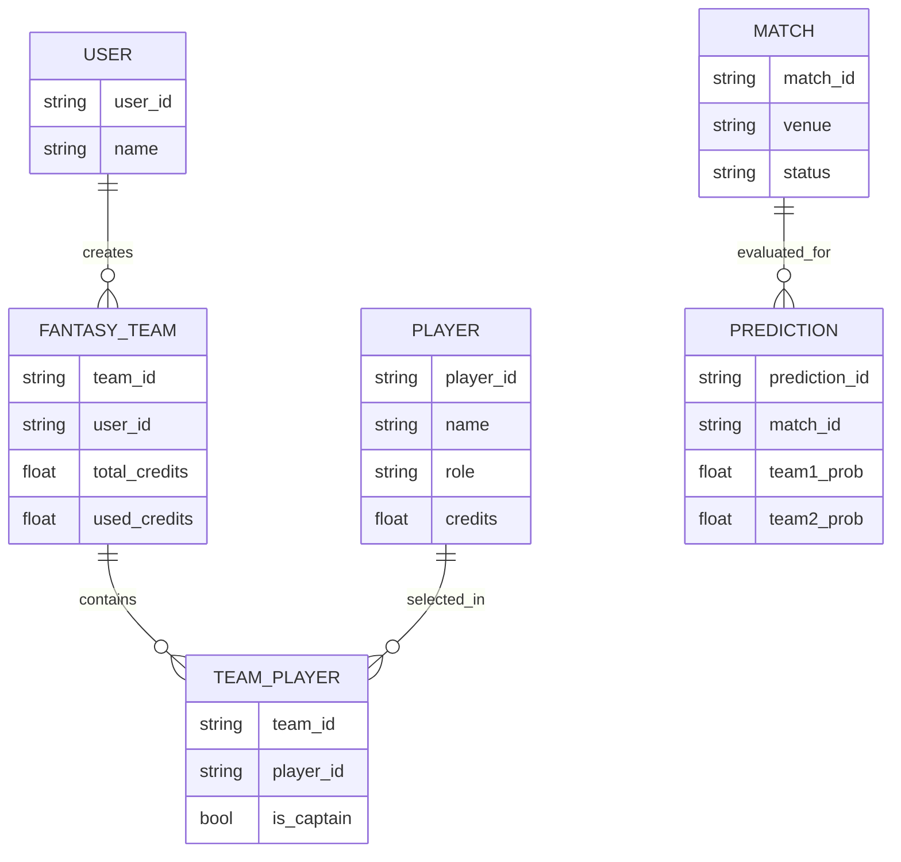
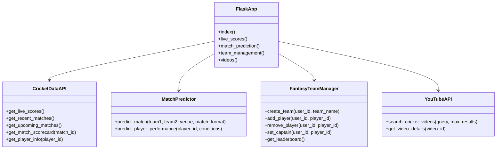
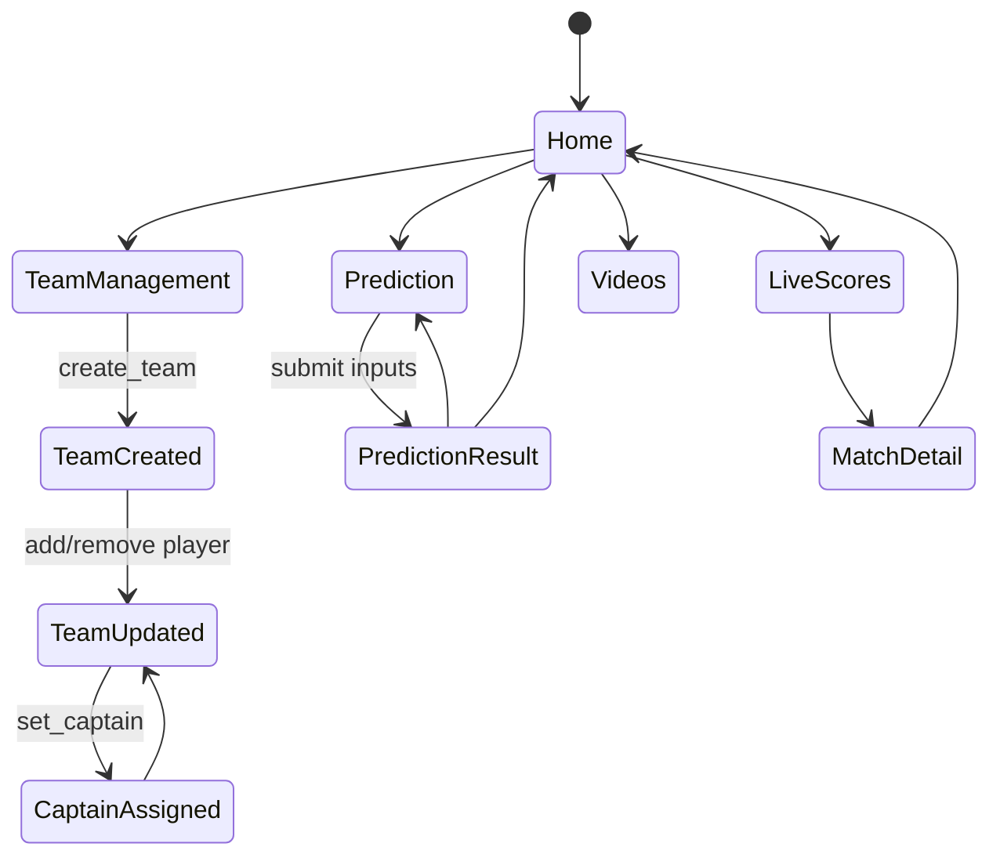
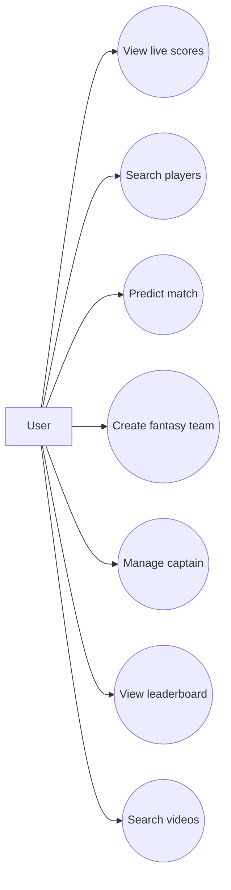
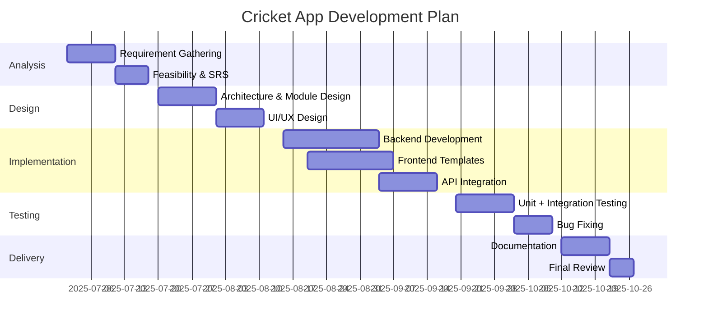
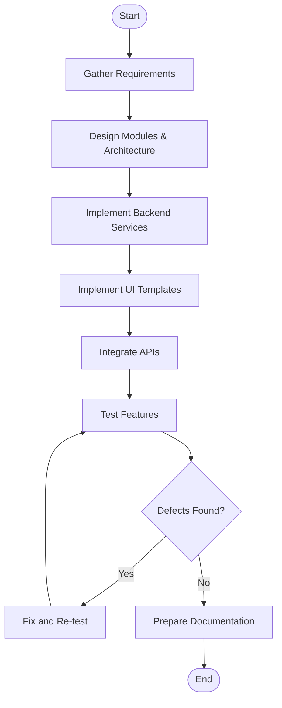

# Cricket Analytics & Fantasy Management System
## Project Report

**Date:** 02 March 2026  
**Project Type:** Full-stack web application (Flask + HTML/CSS/JS)  
**Repository Root:** `cricket_app`

---

## 1. Introduction

### 1.1 Theoretical Background
Cricket information platforms combine **real-time data ingestion**, **domain-specific analytics**, and **interactive decision support**. Modern cricket users expect:
- Live scores and match context
- Predictive insights before or during games
- Fantasy team support for player selection and balance constraints
- Video and news aggregation from external ecosystems

This project follows a service-oriented web model where:
1. Data is fetched from cricket APIs
2. Data is normalized into UI-friendly structures
3. Domain modules (prediction, fantasy, media) process and expose results
4. A template/UI layer renders user-facing pages and API endpoints

### 1.2 Objectives of the Project
1. Build a centralized cricket web app for live/recent/upcoming matches.
2. Provide match prediction support using a lightweight analytical model.
3. Implement fantasy team management with realistic constraints.
4. Integrate cricket video discovery for user engagement.
5. Offer multi-page UI with accessible navigation and clear module separation.

### 1.3 Purpose, Scope and Applicability
**Purpose:** Deliver a practical, extensible cricket platform for learning and usage.  
**Scope:**
- Match data display and retrieval
- Player lookup and statistics display
- Fantasy team formation and validation
- Prediction generation
- YouTube video feed integration

**Applicability:**
- Academic mini/major project submission
- Prototype for sports analytics platforms
- Base architecture for production deployment with persistent storage

---

## 2. Requirement and Analysis

### 2.1 Problem Definition
Users currently rely on multiple disconnected sources for scores, stats, fantasy inputs, and highlights. This fragmentation causes poor decision-making and low usability. The core problem is to provide a **single integrated system** that delivers timely, structured cricket intelligence.

### 2.2 User Requirements / SRS
#### Functional Requirements
- View live, recent, and upcoming matches
- View match scorecard and squads
- Search players and view player details
- Predict match outcome based on teams/venue/format
- Create and manage fantasy teams
- Set captain and view leaderboard
- Search and view cricket videos
- Access JSON APIs for live scores and predictions

#### Non-Functional Requirements
- Responsive and readable UI
- API request timeout and fallback behavior
- Modular backend structure
- Maintainable code organization
- Basic session-based user continuity

### 2.3 Feasibility Study
**Technical Feasibility:** High; uses mature stack (Flask, requests, Python).  
**Economic Feasibility:** High; open-source stack with low infrastructure cost.  
**Operational Feasibility:** High; straightforward user flows and minimal onboarding.  
**Schedule Feasibility:** Achievable in one semester with phased implementation.

### 2.4 Details of Hardware and Software Used
#### Hardware
- Processor: Dual-core or above
- RAM: 4 GB minimum (8 GB recommended)
- Storage: 1 GB free space
- Network: Stable internet for third-party API access

#### Software
- OS: Windows (development environment)
- Language: Python 3.x, JavaScript
- Backend Framework: Flask 3.0
- Libraries: requests, pandas, numpy, scikit-learn (environment-ready)
- Frontend: HTML5, CSS3, JavaScript
- IDE: Visual Studio Code

### 2.5 Planning and Scheduling
Development followed milestone-based incremental delivery:
1. Core Flask app and route skeleton
2. Cricket API integration
3. Prediction and fantasy modules
4. UI templates and interaction improvements
5. Validation and report preparation

### 2.6 Preliminary Product Description
The product is a multi-module cricket web platform with:
- Home dashboard
- Live scores module
- Match prediction page
- Player stats pages
- Team management and leaderboard
- Videos page
- JSON API endpoints for integration

### 2.7 Conceptual Models
The system is based on four conceptual layers:
1. **Presentation Layer** (templates/pages)
2. **Application Layer** (`app.py` routes and orchestration)
3. **Domain Services** (`utils/*.py`)
4. **External Services** (Cricket APIs, YouTube API)

---

## 3. System Analysis and Design

### 3.1 Detailed Life Cycle of the Project
A practical hybrid life cycle was followed:
- Requirement gathering
- Modular design
- Iterative coding and integration
- Functional testing and defect correction
- Documentation and deployment preparation

### 3.2 Basic Modules
1. **Live Scores Module** – fetches and normalizes current match data.
2. **Prediction Module** – computes probability and confidence metrics.
3. **Fantasy Module** – team creation, validation, and leaderboard.
4. **Player Stats Module** – player search and info rendering.
5. **Media Module** – YouTube cricket video discovery.
6. **API Layer** – JSON endpoints for external clients.

### 3.3 Data Design
Current implementation uses in-memory/session structures and API payloads. Logical entities:
- User
- FantasyTeam
- Player
- Match
- Prediction
- Video

### 3.4 Schema Design
Although no RDBMS is currently enforced, the logical schema is:
- `users(user_id, name, created_at)`
- `fantasy_teams(team_id, user_id, name, total_credits, used_credits, created_at)`
- `team_players(team_id, player_id, is_captain, is_vice_captain)`
- `players(player_id, name, team, role, credits, points)`
- `matches(match_id, match_type, status, venue, series, start_time)`
- `predictions(prediction_id, team1, team2, venue, format, win_prob_1, win_prob_2, confidence, timestamp)`

### 3.5 Data Integrity and Constraints
- Max 11 players per fantasy team
- Credit budget cap (100)
- Role constraints (e.g., wicket-keeper cap)
- Team-composition constraints (max players from same real-world team)
- Required input checks for prediction API

### 3.6 Procedural Design
High-level processing sequence:
1. Receive user request at route
2. Invoke appropriate service class
3. Handle API/network exceptions
4. Normalize or compute domain output
5. Render template or return JSON response

### 3.7 Logic Diagrams

#### i. Context Diagram


#### ii. Data Flow Diagram (DFD)


#### iii. Entity Relationship Diagram (ERD)


#### iv. Class Diagram


#### v. State Transition Diagram


#### vi. Use Case Diagram


### 3.8 Architecture Design
Architecture style: **Layered service-oriented web architecture**.
- Entry: Flask route handlers
- Service layer: Cricket, Prediction, Fantasy, YouTube modules
- Integration layer: External APIs
- View layer: Jinja2 templates + static assets

### 3.9 Algorithm Design
Prediction algorithm uses weighted team strengths and venue factors.

Let team strengths be:
- $S_1 = R_1 + \epsilon_1 + H_1$
- $S_2 = R_2 + \epsilon_2 + H_2$

Then win probabilities are:
- $P_1 = \frac{S_1}{S_1 + S_2} \times 100$
- $P_2 = 100 - P_1$

Where:
- $R_i$ = base team rating
- $\epsilon_i$ = controlled random variation
- $H_i$ = home/venue advantage adjustment

### 3.10 User Interface Design
UI is built with route-specific templates and responsive CSS. Primary UI aspects:
- Dashboard cards and match summaries
- Form-based prediction interface
- Team selection and error feedback for fantasy constraints
- Search-driven videos page

### 3.11 Security Issues
Current implementation considerations:
- Session secret key usage
- Input validation for POST APIs
- Exception handling for external service calls

Recommended enhancements:
- Move API keys to environment variables
- Add CSRF protection for forms
- Add rate limiting on API endpoints
- Add authentication and role-based access if multi-user deployment is required

### 3.12 Test Case Design
Test design includes:
- Route-level HTTP success/failure tests
- Unit tests for fantasy constraints
- Prediction output format validation
- API fallback behavior tests

---

## 4. System Planning

### 4.1 Gantt Chart


### 4.2 Activity Diagram


---

## 5. System Implementation / Module-wise Explanation & Testing

### 5.1 Implementation Approaches (Screenshots & Explanations)
> **Note:** Insert screenshots for each page from running application.

Suggested screenshot mapping:
1. Home page (`/`)
2. Live scores (`/live-scores`)
3. Match prediction (`/match-prediction`)
4. Player stats (`/player-stats`)
5. Team management (`/team-management`)
6. Leaderboard (`/leaderboard`)
7. Videos (`/videos`)

### 5.2 Coding Details and Code Efficiency
- Modular class-based utility services reduce route complexity.
- API calls include timeout controls and fallback behavior.
- Reusable helper normalization for match data consistency.
- In-memory structures are efficient for prototype scope.

### 5.3 Testing Approach
- **Black-box testing:** route outputs, status code, rendered content checks
- **White-box testing:** branch checks for constraints and fallback paths
- **Boundary testing:** player limit, credit exhaustion, missing parameters

### 5.4 Test Cases
| Test ID | Module | Input | Expected Result | Status |
|---|---|---|---|---|
| TC01 | Home | GET `/` | Page loads with match/video blocks | Pass |
| TC02 | Live Scores | GET `/live-scores` | Live/recent/upcoming visible | Pass |
| TC03 | Prediction | Valid form POST | JSON/object with probabilities and favorite | Pass |
| TC04 | Prediction API | Missing `team1` | HTTP 400 with error | Pass |
| TC05 | Fantasy | Add 12th player | Error: team already has 11 players | Pass |
| TC06 | Fantasy | Add duplicate player | Error: already in team | Pass |
| TC07 | Fantasy | Exceed credit budget | Error: not enough credits | Pass |
| TC08 | Videos | Query string search | Filtered cricket videos list | Pass |

### 5.5 Modifications and Improvements
Completed/observed enhancements:
- Improved normalization between API payload and template expectations
- Added fallback data for API failure continuity
- Added team validity report in fantasy module

Future improvement candidates:
- Persistent database integration
- User authentication and saved profiles
- Stronger probabilistic modeling with historical datasets

---

## 6. Cost & Benefit Estimation

### Estimated Cost (Prototype/Academic)
| Cost Head | Approx. Amount |
|---|---|
| Development tools | Minimal (open-source) |
| Hosting (optional cloud VPS) | ₹500–₹1500 / month |
| Domain (optional) | ₹800–₹1200 / year |
| API subscription overhead (as scale grows) | Variable |
| Maintenance time | Moderate |

### Benefits
- Consolidated cricket user workflow
- Better fantasy selection support
- Reusable architecture for production-grade extension
- Strong educational value in API integration and modular design

---

## 7. Documentation and Reporting

### 7.1 Test Reports
A summarized report from executed module checks:
- Core pages render successfully
- API error handling returns safe fallback data
- Fantasy constraints enforce business rules correctly
- Prediction endpoints respond with structured output and validation

### 7.2 User Documentation
#### End-user Steps
1. Start the Flask server.
2. Open browser at `http://127.0.0.1:5000`.
3. Navigate through modules from home page.
4. For prediction, provide teams, venue, and format.
5. For fantasy, add players and set captain within constraints.

#### Admin/Developer Notes
- Configure API keys in environment-secure settings.
- Run dependency install from `requirements.txt`.
- Monitor API quota and timeout behavior.

---

## 8. Conclusion

### 8.1 Significance of the System
The system demonstrates practical integration of sports APIs, predictive support, and fantasy logic into a single coherent platform. It bridges data retrieval and user decision assistance.

### 8.2 Conclusion
Project objectives were achieved at prototype level with modular and scalable design. The application supports multiple cricket-focused use cases through a unified interface and manageable backend codebase.

### 8.3 Limitations of the System
- No persistent relational/NoSQL storage in current version
- Limited model sophistication in prediction logic
- API key and rate-limit dependencies on third-party providers
- Minimal authentication/authorization controls

---

## 9. Future Work
1. Integrate database (PostgreSQL/MySQL) for persistent users and teams.
2. Introduce ML-based prediction using historical ball-by-ball data.
3. Add login system and secure role-based account management.
4. Add caching and background job queue for API efficiency.
5. Add unit/integration automation pipeline (CI/CD).
6. Build mobile app clients using shared backend APIs.

---

## 10. References
1. Flask Official Documentation – https://flask.palletsprojects.com/
2. Requests Library Documentation – https://docs.python-requests.org/
3. CricketData API / CricAPI documentation
4. YouTube Data API v3 documentation – https://developers.google.com/youtube/v3
5. Python Official Documentation – https://docs.python.org/3/

### 10.1 GLOSSARY
- **API:** Application Programming Interface
- **DFD:** Data Flow Diagram
- **ERD:** Entity Relationship Diagram
- **SRS:** Software Requirement Specification
- **UI/UX:** User Interface/User Experience
- **CRUD:** Create, Read, Update, Delete

### 10.2 APPENDIX A
#### Environment Setup
```bash
pip install -r requirements.txt
python app.py
```

Default URL: `http://127.0.0.1:5000`

### 10.3 APPENDIX B
#### Route Inventory
- `/` – Home dashboard
- `/live-scores` – Match live/recent/upcoming panel
- `/match/<match_id>` – Match detail
- `/match-prediction` – Prediction UI
- `/player-stats` – Player search/stats
- `/player/<player_id>` – Player detail
- `/news` – Cricket news
- `/team-management` – Fantasy management
- `/leaderboard` – Fantasy ranking
- `/videos` – Video discovery
- `/api/live-scores` – JSON live scores endpoint
- `/api/predict` – JSON prediction endpoint
